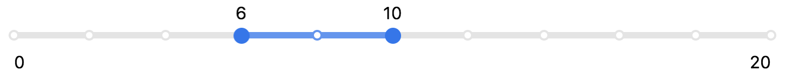

# react-slider

[](https://codecov.io/gh/filter-components/react-slider)
[](https://travis-ci.org/filter-components/react-slider)
[](https://github.com/filter-components/react-slider)
[](https://raw.githubusercontent.com/filter-components/react-slider/master/LICENSE.md)
[](https://github.com/semantic-release/semantic-release)

> A fully featured slider component made in React.





### Installation
```
npm install --save @filter-components/react-slider
```

### Basic Usage

```js
import {Toggle} from 'react-controls';

export default class X extends React.Component{
 render() {
    <Slider
      name={'vertical'}
      orientation={'vertical'}
      showSteps
      onDragStart={action('drag-start')}
      onDragEnd={action('drag-end')}
    />
   }
}
```


### Props

prop name | defaultValue | type
-------|------|------
attributes| `{}` |Sometimes you may need to add some custom attributes to the root tag of the component. attributes will accept an object where the key and values will be those attributes and their value respectively. Eg : If you pass `attributes = {'data-attr1' : 'val1','data-attr2' : 'val2'}`the root tag will have the attributes `data-attr1` and `data-attr2` with the corresponding values as `val1` and `val2` respectively
className| '' |Optional className to be added to the root tag of the component
max|20|maximum limit of the slider
min|0|minimum limit of the slider
disabled| `false` |To disable or not to disable
name|''|name of the component
onChange| `({name, value})` | function triggered when the value changes
onDragStart| `({name, value})` | function triggered when the sliding starts
onDragEnd| `({name, value})` | function triggered when the sliding stops
orientation|`'horizontal'`| `'horizontal'` or `'vertical'`
rangeTemplate|`[function](#rangeTemplate)`|Returns an element that shows the slider range.
readOnly|`false`| Boolean
showSteps|`false`| whether or not to show steps.
step|1|The difference between two sliding positions.
tooltipTemplate|`[function](#tooltipTemplate)`|Returns the tooltip element.
type|`'range'`| 'value' or 'range'
value| `[5, 10]` ️|Can be a number or an array based on whether the type is 'value' or 'range
 respectively.


#### `rangeTemplate`

defaultValue:
```js
function (min, max) {
    return (
      <div className='slider-range' >
        <div className='slider-range-min' >{min}</div>
        <div className='slider-range-max' >{max}</div>
      </div>
    );
  }
```

#### `tooltipTemplate`

defaultValue:
```js
function (value) {
    return value;
  }
```

## Development
1. Clone the repo
1. Create a new branch.
1. Run `npm install && npm run storybook`
1. You can find the server running at **localhost:9002**
1. Add feature or fix bug. Add tests if required.
1. if commit fails make sure that there's no linting error or failed test by running `npm run test && npm run lint`


## License
MIT @ Ritesh Kumar